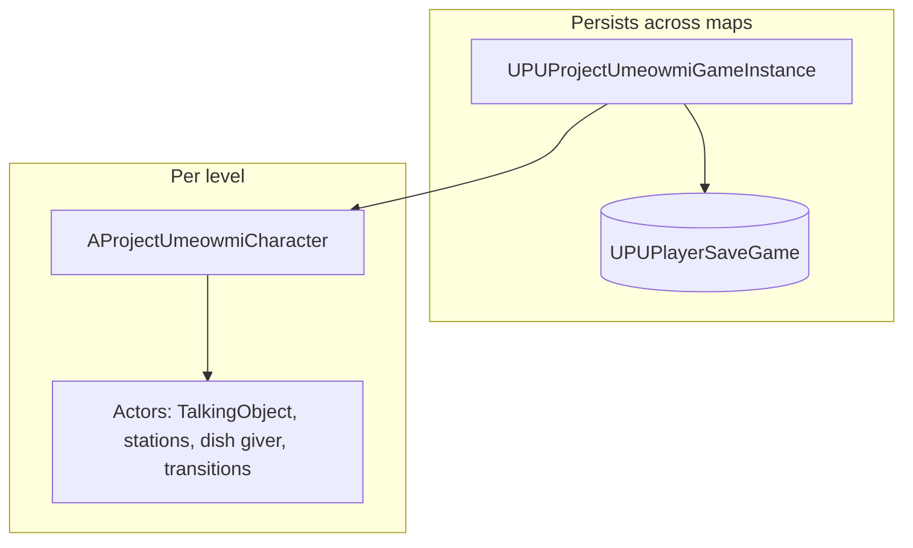

# Architecture — Developer Documentation

**Module:** `ProjectUmeowmi` (single game module; primary C++ under `Source/ProjectUmeowmi/`)

This page is a **high-level map** only. Detailed APIs live in the per-system docs linked below.

---

## Runtime layers

- **`UPUProjectUmeowmiGameInstance`** — Save/load, ingredient and dish unlocks, journal helpers, level transition orchestration, quest forwards, popup queue, dialogue settings, tutorial flags. See **`GameInstance.md`** and **`SaveLoad.md`**.
- **`AProjectUmeowmiCharacter`** — Current **order** copy, **dish capture** for scorecard, **dialogue** and **journal** widget refs, **dish scoring** mode, **emotes**, interaction with **TalkingObjects**. See **`PlayerCharacter.md`**.
- **`ATalkingObject` hierarchy** — Dialogue, overlap-based interaction, quest hooks; **`APUDishGiver`**, **`APUCookingStation`**, **`APUPlatingStation`**, **`APULevelTransition`**. See **`Dialogue.md`**, **`Interactables.md`**, **`Orders.md`**, **`DishCustomization.md`**, **`LevelTransitions.md`**.

---

## Data flow (typical)

| Flow | Path |
|------|------|
| **Order given** | Dialogue / `APUDishGiver` → generates `FPUOrderBase` → copied to **player** `CurrentOrder`. |
| **Cooking / plating** | `UPUDishCustomizationComponent` + `UPUDishCustomizationWidget` mutate `FPUDishBase`; completion ties to order on submit. |
| **Scorecard** | Completed order + `GetScorecardData` → `UPUScorecardWidget`; dish image from character capture pipeline. **`Scorecard.md`**, **`DishCustomization.md`**. |
| **Progression** | Unlocks and quest state → **game instance** / **save**; UI reads via GI or character. **`SaveLoad.md`**, **`QuestSystem.md`**, **`Journal.md`**. |

---

## Source layout (concise)

| Area | Path | Doc |
|------|------|-----|
| Game instance | `PUProjectUmeowmiGameInstance.*` | **`GameInstance.md`** |
| Player | `ProjectUmeowmiCharacter.*` | **`PlayerCharacter.md`** |
| Orders | `DishCustomization/PUOrderBase.*`, `PUOrderComponent.*`, `PUOrderBlueprintLibrary.*` | **`Orders.md`** |
| Dish / ingredients | `DishCustomization/` | **`DishCustomization.md`** |
| Dialogue / Dlg | `Dialogue/` | **`Dialogue.md`** |
| Quests | `Quest/` | **`QuestSystem.md`** |
| Interactables / transitions | `Interactables/`, `LevelTransition/` | **`Interactables.md`**, **`LevelTransitions.md`** |
| UI | `UI/` | **`UI.md`** + feature docs |

---

## Third-party / engine plugins

- **Dlg System** — Dialogue graphs and participants.
- **Common UI** — Project bases `UPUCommonUserWidget`, tab lists, etc.
- **Radar chart** (Marketplace) — Extended by **`UPURadarChart`** (`Scorecard.md`).

---

## Document change log

| Version | Date | Author | Description |
|---------|------|--------|-------------|
| 1.0.0 | 2026-03-25 | Documentation | Initial architecture overview for ProjectUmeowmi. |
