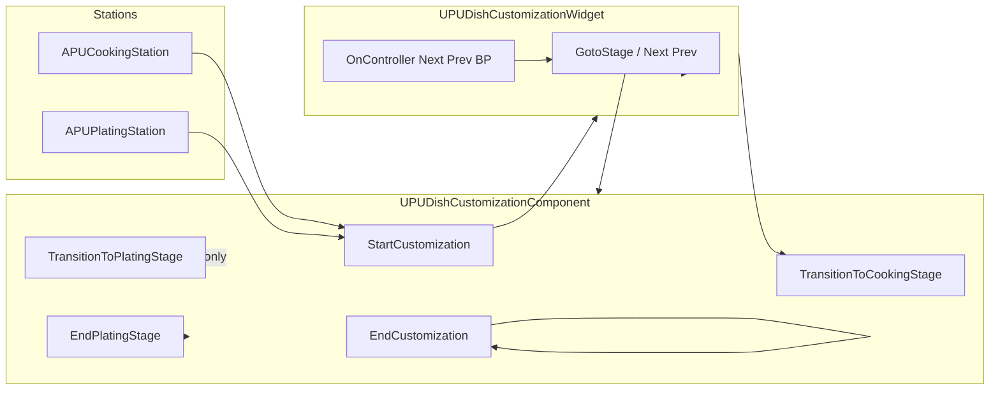

# Dish customization — migration roadmap (2D shell + Congee pipeline)

**Companion:** [`DishCustomization.md`](DishCustomization.md) (API reference).  
**Purpose:** Ordered phases from safest groundwork to removing reliance on 3D plating; **ordering principle:** never block shipping Congee on deleting all 3D globally — legacy stations can remain behind flags until Phase 7 catches up.

**Progress snapshot**

| Phase | Status |
|-------|--------|
| 0 — Design primitives | ☐ Not started (team checklist below) |
| 1 — Spine audit | ☑ Initial C++ / widget spine documented below *(Blueprint subclass inventory: editor-side)* |
| 2 — Stage orchestration | ☑ Dish pipeline structs + component index API *(Congee rows authored in DT / BP; shell auto-navigation = Phase 3)* |
| 3–6 | ☐ |
| 7 — Slim component | ~☑ Partial: **`bUse2DCustomizationMode`**, teardown fixes, dead spring-arm transition removal *(extract/fork + scorecard retarget still open)* |
| 8 | ☐ |

---

## Already landed (before Phase 0 checklist)

- **`UPUDishCustomizationComponent`**: UI-first exit (`EndCustomization`), **`OnCustomizationEnded`** deferred to **next tick**, re-entry guards, no **`SetAllUserFocusToGameViewport`** on teardown, **`CookingStation` / `PlatingStation`** guard **`EndInteraction`** during teardown.
- Dead **spring-arm customization** interpolation (`StartCameraTransition`, `UpdateCameraTransition`, etc.) removed; legacy **station ortho cameras** still exist when **`bUse2DCustomizationMode == false`**.

---

## Phase 0 — Lock design primitives (short)

Complete as a design workshop; unblock Phase 2+ engineering.

- [x] **Shell:** fixed regions (journal, stage banner, dish title, gear, stats, recipe log, bottom bar); pantry behavior matches today’s **open on slot focus**.
- [x] **Two workspace modes:** **Gather** = counter slot grid + pantry; **other steps** = 2×4 rail + stage vignette.
- [x] **Advance rule:** one clear primary action (e.g. bottom **Cook** vs panel pot — pick **one** path).
- [x] **Scorecard:** decide how the final dish is represented **without** plating meshes (2D hero art, last-stage screenshot, static thumbnail, etc.) — **this unblocks removing 3D later.**

---

## Phase 1 — Map the real spine (audit)

**Deliverable:** this section plus checklist *(Blueprint widget subclasses: enumerate in Editor via Parent Class = `PUDishCustomizationWidget`; `Content/` was not in workspace for automated grep).*

### Entry / exit (stations → component)

| From | To | Notes |
|------|-----|--------|
| `APUCookingStation::StartCustomizationFromCurrentOrder` | `DishCustomizationComponent->StartCustomization` | Tables + initial dish from order; may call `StartPlanningMode` on dialogue path |
| `APUCookingStation::EndInteraction` (and delegates) | `EndCustomization` | Deferred **`Super::EndInteraction`** when teardown guard active |
| `APUPlatingStation::…` | `PlatingComponent->StartCustomization` / `EndCustomization` | Parallel TalkingObject pattern |

### `StartCustomization` → session alive (`UPUDishCustomizationComponent`)

- Store **`OriginalDishContainerMesh`**; set **`CurrentCharacter`**; notify **`GameInstance`** (quest overlay, **`NotifyPlayerQuestObjectiveOverlayVisibility`**).
- **Input:** `SetIgnoreMove/Look`, Enhanced Input layer (**CustomizationMappingContext**), exit / mouse / controller / **NextStage** / **PreviousStage** / quantity binds; optional Slate **pre-input** (editor).
- **Virtual cursor** path when **`VirtualCursorWidgetClass`** set.
- **Widget:** create **`CustomizationWidget`** from **`CustomizationWidgetClass`**, link **`UPUDishCustomizationWidget::SetCustomizationComponent`**, **`BroadcastInitialDishData`** if dish tag valid.
- **Deferred viewport hook:** **`OnCustomizationViewportDeferredSetup`** next tick (capture mode sync).

### Stage navigation (widget-led vs component-led)

| Mechanism | Location | Behavior |
|-----------|-----------|----------|
| **`NextStageAction` / `PreviousStageAction`** | Component **`HandleNextStage` / `HandlePreviousStage`** | Forwards to **`OnControllerNextStage` / `OnControllerPreviousStage`** (BlueprintImplementableEvent on **`UPUDishCustomizationWidget`**) |
| **`GoToNextStage` / `GoToPreviousStage`** | **`UPUDishCustomizationWidget`** | **`CreateWidget`** from **`TSubclassOf` PreviousStage / NextStage**, then **`GoToStage`** |
| **`GoToStage`** | **`UPUDishCustomizationWidget`** | On leave **Plating:** **`CapturePlatingTransformsFromMeshes`**, **`CaptureScorecardSnapshotFromPlatingStation`**, **`ClearAll3DIngredientMeshes`**, **`SetPlatingMode(false)`**, **`RestoreOriginalDishContainerMesh`**. On enter **Plating:** **`SetPlatingMode(true)`**, plating reset, **`SwitchToPlatingCamera()`**, **`SwapDishContainerMesh`**. On enter **Cooking:** **`SwitchToCookingCamera()`**, restore bowl mesh. Updates **`SetActiveCustomizationWidget`**. |
| **`TransitionToCookingStage`** | Called from **`PUDishCustomizationWidget.cpp`** (planning → cooking) | Spawns **`CookingStageWidgetClass`** instance when legacy cooking widget swap needed |
| **`TransitionToPlatingStage`** | **Component only** in C++ | **No native callers** — assume **Blueprint** usage only unless orphaned |

### `EndCustomization` → teardown

- **`EndPlatingStage`** if **`bPlatingMode`** *(captures transforms + scorecard snapshot inside plating teardown path)*.
- Unbind input, remove mapping context, restore movement/cursor/input mode / viewport capture.
- Remove virtual cursor + customization widgets; **`ClearAll3DIngredientMeshes`**, **`RestoreOriginalDishContainerMesh`**, **`ClearCurrentDishTag`**, clear **`CurrentCharacter`**.
- **`BroadcastOnCustomizationEndedNextTick`** ( **`OnCustomizationEnded`** next frame).

### 3D / camera gates (**`bUse2DCustomizationMode`**)

When **`true`**, early-outs Skip **`SpawnVisualIngredientMesh`**, **`SwitchToCookingCamera`**, plating mesh swap hooks tied to legacy framing, etc. *(See [`DishCustomization.md`](DishCustomization.md) property table.)*

### Spine diagram (high level)

### Phase 1 checklist — keep / bypass / delete (draft)

| Item | Suggestion |
|------|------------|
| **`EDishCustomizationStageType`** enum | **Keep** until Phase 2 pipeline descriptors supersede it; extend alongside arrays |
| **`GoToStage`** plating cleanup + snapshot | **Keep** until scorecard source moved off plating meshes (Phase 0 + 7) |
| **`TransitionToPlatingStage`** | **Verify BP callers**; candidate **delete/bypass** when all flows use shell + data stages |
| Legacy ortho **SwitchToCookingCamera** / **SwitchToPlatingCamera** | **Bypass** when **`bUse2DCustomizationMode`**; eventually Phase 7 |
| 3D ingredient spawn/drag | **Bypass/delete** per Phase 7–8 after scorecard decision |

---

## Phase 2 — Introduce stage orchestration (data-first)

**Implemented (code):**

- **`EDishCustomizationStageType`** moved to **`PUDishBase.h`** (shared with **`UPUDishCustomizationWidget`**).
- **`EDishCustomizationWorkspaceMode`**, **`FPUDishCustomizationStageDescriptor`**, and **`FPUDishBase::CustomizationStages`** — author ordered steps on the dish row (StageId, display name, **`LegacyStageKind`**, **`WorkspaceMode`**, **`StageWidgetClass`**, pantry tag filter, optional **`AdvanceGateTag`**).
- **`UPUDishCustomizationComponent`**: **`HasActiveCustomizationPipeline`**, **`TryGetActivePipelineStage`**, **`AdvanceCustomizationPipeline`**, **`ResetCustomizationPipelineProgress`** (called from **`StartCustomization`**), index cleared in **`EndCustomization`** / when dish loses pipeline in **`UpdateCurrentDishData`**.

**Still Phase 3+:** shell widget host swapping **`StageWidgetClass`**, replacing **`GoToNextStage`** subclass chains when pipeline present.

**Congee** — author five rows on the Congee dish asset (gather → chop → marinate → cook → garnish) with distinct **`StageId`** tags and BP widget classes.

**Deliverable:** Congee driven by **data + widget refs**, not five unrelated hardcoded flows.

---

## Phase 3 — Build the shell widget

New shell **UserWidget** (or refactor root BP):

- Persistent chrome (right rail, headers).
- Content slot: gather workspace **or** rail + vignette.
- Single pantry instance / reuse **OpenPantry** APIs + filters.
- Wire **`FPUDishBase`** updates → Recipe Log + radars.

**Deliverable:** shell stable across stages; inner content swaps only.

---

## Phase 4 — Vertical slice: Congee “Gather base” only

2×2 (or 2×N) counter grid + pantry (base-only). Recipe Log base row shares source of truth with **`IngredientInstances`** (or thin staging struct).

**Deliverable:** playable gather step end-to-end; advance stubbed/mocked; UI-only framing if possible.

---

## Phase 5 — Remaining Congee stages (still 2D)

Per step: 2×4 rail + rules; center placeholder until minigames exist.

**Deliverable:** full linear Congee in UI (“click to complete” gates OK).

---

## Phase 6 — Minigames incrementally

Center actions as modules (widget or BP interface): snapshot in → **`FPUDishBase`** deltas out.

**Deliverable:** staged rollout without blocking on every minigame.

---

## Phase 7 — Slim or fork `UPUDishCustomizationComponent`

Extract session essentials (input, virtual cursor if needed, **`CurrentDishData`** sync, delegates) **without** cooking/plating camera + mesh spawn.

- Gate legacy via **`#ifdef`**, runtime flag, **subclass**, or **`UPUDishCustomization2DComponent`** — keep **`APUCookingStation`** sane during migration.
- Retarget scorecard capture to **Phase 0 decision**; remove **`GatherDishSnapshotPrimitives`** reliance where obsolete.

**Deliverable:** 3D plating optional or deleted; Congee never hits legacy branches.

---

## Phase 8 — Migrate other dishes and delete dead code

Author pipelines per dish; remove **`TransitionToPlatingStage`** paths once unreferenced.

Update **`DishCustomization.md`** for shell + stage table.

---

## Changelog

| Version | Date | Notes |
|---------|------|--------|
| 1.0.1 | 2026-05-10 | Phase 2: dish **`CustomizationStages`**, **`FPUDishCustomizationStageDescriptor`**, component pipeline APIs |
| 1.0.0 | 2026-05-10 | Initial roadmap + Phase 1 C++ spine audit |
